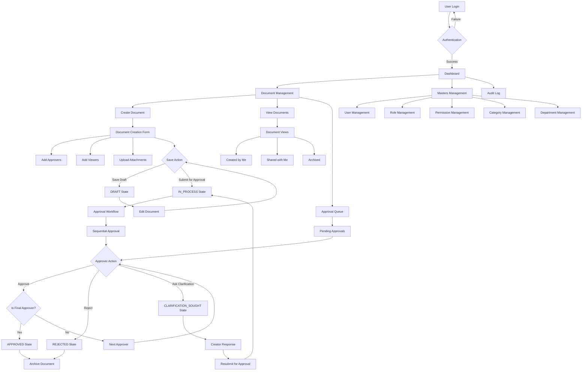
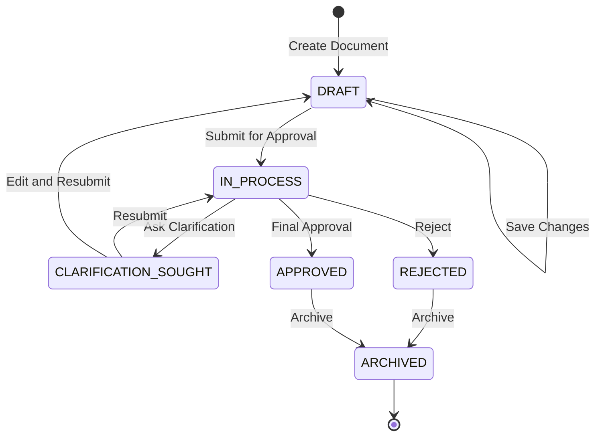
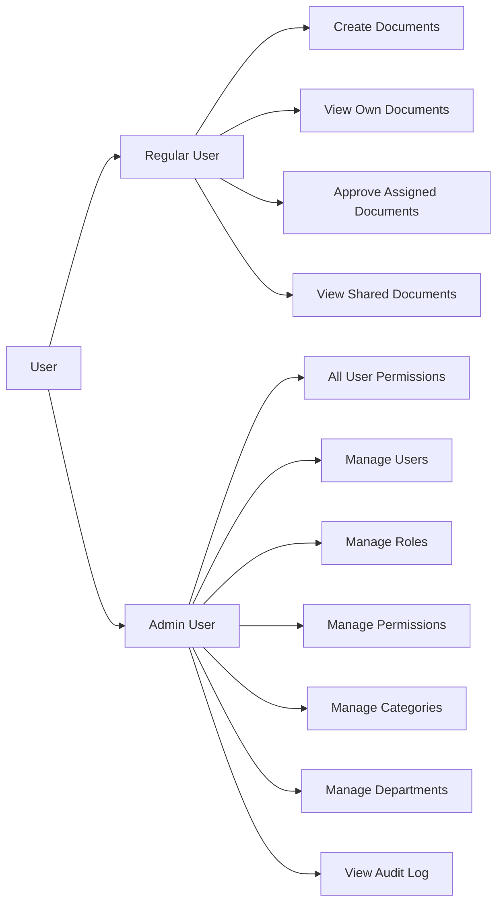
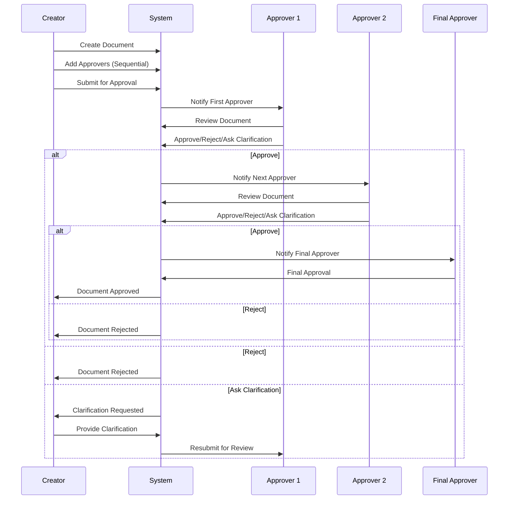

# eON Document Management System - Workflow

## Main Application Workflow

## Document States and Transitions

## User Roles and Permissions

## Approval Sequence Workflow

## Key Features

### Document Management
- **Create**: Rich text editor, approver selection, viewer assignment, attachments
- **Edit**: Modify draft documents, update approvers/viewers
- **View**: Document details, approval sequence, activity timeline, comments
- **Archive**: Move completed documents to archive

### Approval System
- **Sequential Approval**: Ordered approver sequence
- **Final Approver**: Designated final approval authority
- **Actions**: Approve, Reject, Ask Clarification
- **Comments**: Add comments with actions
- **Notifications**: Real-time approval status updates

### User Management
- **Authentication**: Email-based login
- **Roles**: Admin and regular user roles
- **Permissions**: Granular permission system
- **Departments**: Organizational structure
- **Categories**: Document categorization

### Audit & Tracking
- **Activity Log**: Complete document lifecycle tracking
- **User Actions**: Login, logout, document operations
- **Approval History**: Complete approval sequence with timestamps
- **Comments**: Threaded discussion system
